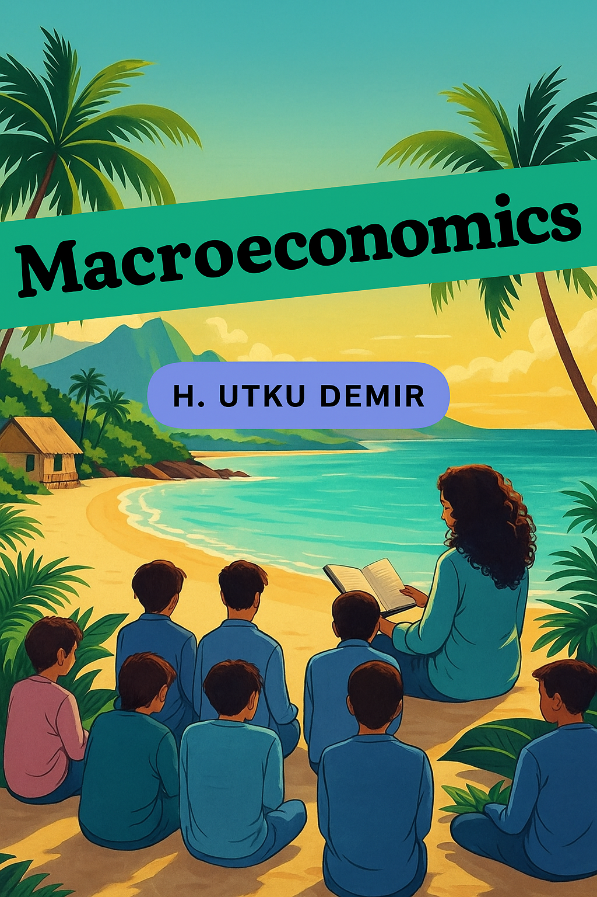

## Macroeconomics: An Island Story  
*(Kindle / Paperback)*

**One-Line Pitch**  
Why do so many graduates struggle even after years of study? *Macroeconomics: An Island Story* combines clear explanations and engaging stories — from Island Country narratives to a central bank simulation game — to show how theory connects to real lives.

---

### Versions

| Format | ASIN | Notes |
|---|---|---|
| **eBook (Kindle)** | *B0FRNQZMRP* | Digital version with “Look Inside” support |
| **Paperback** | *B0FRPHPRJ5* | Traditional print edition, ideal for classrooms |

---

### What You’ll Learn

- Grasp macro concepts: inflation, unemployment, growth, fiscal/monetary policy  
- Use human stories to anchor theory in everyday life  
- Think like a policymaker via an interactive central bank simulation  
- Analyze global crises, structural change, technology disruption  
- Bridge theory and practice with charts, exercises, and real examples  

---

### Description / Excerpt

This textbook is written for undergraduates, graduate students, and instructors. *Macroeconomics: An Island Story* opens each chapter with a narrative from Island Country, grounding abstract models in real human experience. Then it builds through theory, data, and policy, connecting ideas to lived realities.

**An Island Story from Chapter 3**

> *“Professor Zühal continued: “The island residents living on the north side of the island, in the hills where the university campus now stands, developed methods for salting and drying fish. Crises trigger innovations.”
>
> Zeynep asked curiously: “So, professor, what does this have to do with money?”
>
> “This is the critical point, Zeynep. Dried fish didn’t spoil; it lasted for weeks. People started bringing fresh fish here and getting dried fish. But those living in this area couldn’t give everyone dried fish at the same time—because the drying process took time.”
>
> Selin immediately made the connection: “So they were giving some kind of promissory note? Like ‘Come on this date, get your dried fish’?”
>
> “Exactly, Selin! And this became Island Country’s first financial instrument. They started giving ‘fish receipts’ by carving marks on pieces of wood.”
>
> Professor Zühal continued: “And guess what happened? People started exchanging these receipts among themselves. For example, a carpenter receives fish receipts for a table he made, then can buy nails from the blacksmith with these receipts.”
>
> Murat, astonished: “So money actually emerged from a promissory note, professor?”
>
> “It seems so, Murat.”
>
> Emre thoughtfully: “Professor, then it’s actually a matter of trust, isn’t it? People accepted the receipts because they trusted the north side.”
>
> “Excellent observation, Emre! And this is precisely the fundamental reason why the Island Lira lost value during crisis periods—loss of trust.”*

**An Island Story from Chapter 4**

> *Professor Zühal paused while writing her report for the Island Council. She was about to begin with “The past was worse,” but stopped. That sentence seemed to absolve today’s politicians. Yet that was precisely the problem—everyone absolved themselves by comparing to the past.*
>
> **Zeynep’s Story**  
> Zeynep still remembered the joy of receiving her diploma from the island’s most prestigious university. Her family had spent all their savings on four years of Business Administration studies. Her father invested half his pension in dormitory fees each month; her mother tried to earn extra income through handicrafts. “Study, daughter, don’t be like us,” they’d said. And Zeynep had studied. She graduated with honors.
>
> Eight months had passed since graduation. Zeynep now worked as a cashier at A-Market, the island’s largest supermarket chain. She started at seven in the morning and worked until ten at night. After thirteen hours on her feet, her legs swelled so much she struggled to remove her shoes. Her salary was slightly above minimum wage. At least they paid insurance premiums—half premiums, actually, but better than nothing. Her classmate Berkay’s story was entirely different. His father was a member of the Island Business Council. Before graduation, his father arranged an “internship” at a friend’s company. Now he was assistant marketing director. His salary was five times Zeynep’s. ...*

These narrative examples illustrate how macroeconomic dynamics — money, credit, inflation, crises — play out in the lives of individuals, not just in graphs and equations.
---

### Publication Details

- Publication Date: September 17, 2025  
- Language: English  
- Page Count: 293 pages  
- Format: Kindle / Paperback  
- Publisher: Independently published  

---

### Buy / Access

[Buy on Amazon](https://www.amazon.com/dp/B0FRNQZMRP)

---

### Audience & Use Cases

This book is ideal for:

- University students learning macroeconomics for the first time  
- Instructors seeking a narrative approach to teaching macro  
- Lifelong learners who want to see economics in real life  
- Study groups, reading circles, or self‐study  

---

### Notes / Author

Dr. Hüseyin Utku Demir is an economist and educator whose work blends storytelling and economic theory. He taught courses at Karabuk University and at CUNY (Brooklyn College, Hunter College, City College) and writes to make macroeconomics accessible and alive.

---
